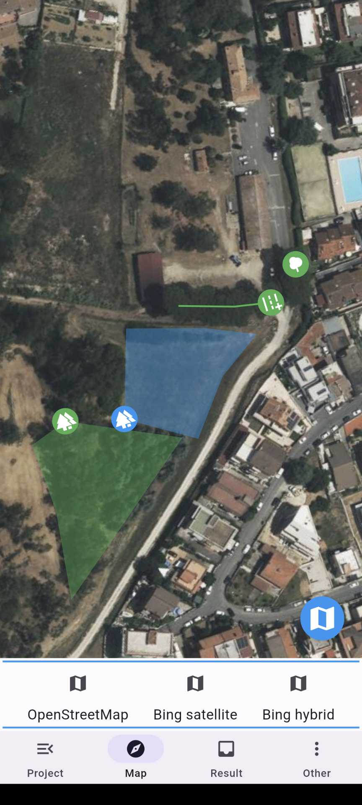
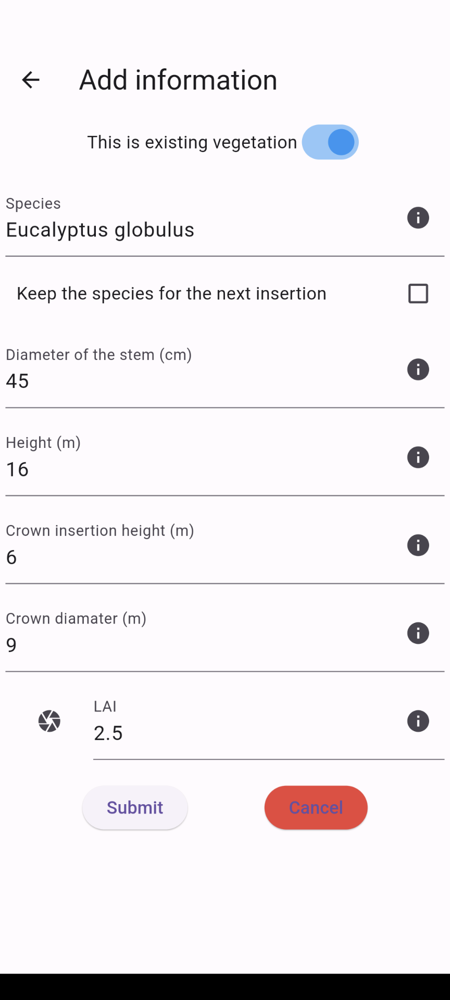
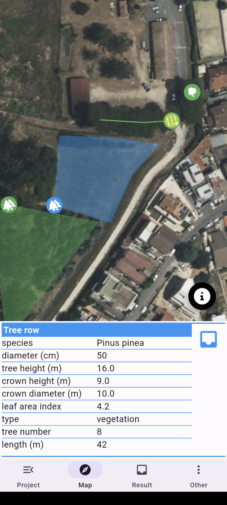
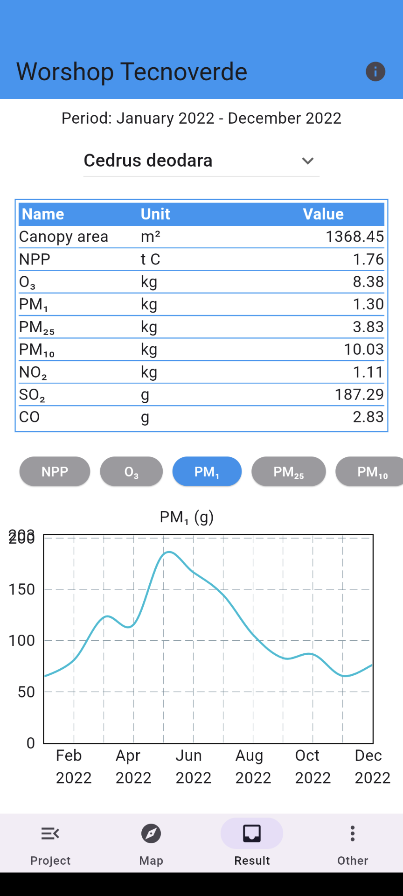

# Airtree Server
&nbsp;&nbsp;&nbsp;&nbsp;&nbsp;&nbsp;&nbsp;&nbsp;
&nbsp;&nbsp;&nbsp;&nbsp;&nbsp;&nbsp;&nbsp;&nbsp;
&nbsp;&nbsp;&nbsp;&nbsp;&nbsp;&nbsp;&nbsp;&nbsp;
---

Copyright (c) 2023 Council for Agricultural Research and Economics (CREA) & National Research Council (CNR) \
Fundings:  POR FESR Lazio 2014-2020 (POR), project TECNOVERDE, CUP B85F20003230006


     


## Description
The Airtree server is paired with [Airtree app](https://github.com/aalivernini/airtree_app) to estimate the quantities of carbon dioxide and air pollutants (e.g. particulate matter and ground-level ozone) removed by the trees.
The server includes the Airtree model, developed in collaboration between CREA and the National Research Council (CNR), which systematizes structural information of the trees (e.g. height of the tree, width of the crown), eco-physiological information (e.g. the speed of the chemical reactions involved in photosynthesis) and time series of climate data and air pollutants.
With this information, Airtree estimates the amount of light that is captured by the tree's canopy, simulates the opening of the stomata on the leaves (the pores through which trees breathe) and then calculates the amount of carbon and pollutants removed from the atmosphere.

## Setup
1) clone the repository into a your directory (DIR)
2) set up the Docker environment
```
sudo apt update
sudo apt install -y apt-transport-https ca-certificates curl software-properties-common lsb-release

curl -fsSL https://download.docker.com/linux/ubuntu/gpg | sudo gpg --dearmor -o /etc/apt/trusted.gpg.d/docker-archive-keyring.gpg
sudo add-apt-repository "deb [arch=amd64] https://download.docker.com/linux/ubuntu $(lsb_release -cs) stable"
sudo apt install -y docker-ce
```
3) copy below text in a file named .env\
The file must be located in the root directory (DIR)
```
data_dir="airtree_server/data"
host_address="MY_SERVER_ADRESS"
ssh_user="root"
mongo_user="root"
mongo_pass="nYppppESCNiFOn%m"
AIRTREE_KEY="7NEb35BAE.tMB0Nio0voyjXiTOwr0sGI"
```
4) edit the file changing the host_address to the public IP used by your machine
5) initialize the dockers
```
./init_docker.sh
```
6) download the airtree sample dataset from [here](https://filedn.com/lJmhEDy1NtXRoqpqwjGBwUB/airtree/server/airtree_server_data_sample.zip) and extract the zip data.\
copy the data directory in the root directory (DIR)
7) upload the airtree dataset to the server
```
cd init
./insert_data.py
```


